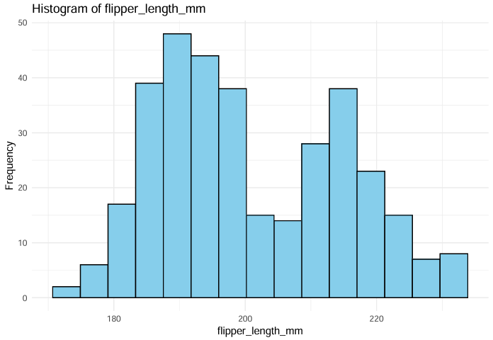
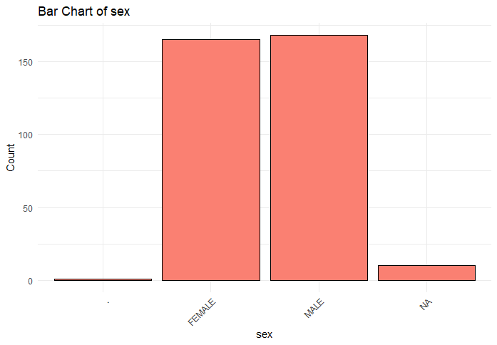
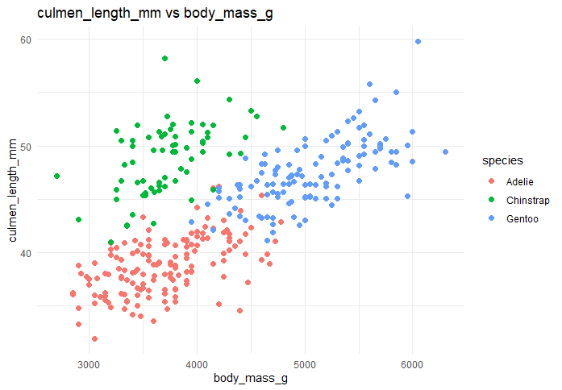
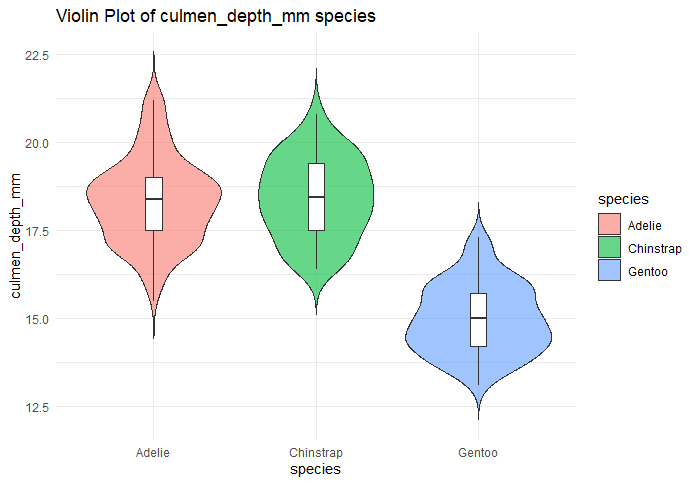

# 🐧 penguin data visualization and exploration (R)

This project performs exploratory data analysis and statistical testing on the [Palmer Archipelago (Antarctica) Penguin Dataset](https://www.kaggle.com/datasets/parulpandey/palmer-archipelago-antarctica-penguin-data) using R.

---

## 📁 Dataset

- File: `penguins_size.csv`  
- Source: [Kaggle Dataset](https://www.kaggle.com/datasets/parulpandey/palmer-archipelago-antarctica-penguin-data)  
- Make sure the CSV file is in your project directory.

---

## 📦 Required Packages

```r
install.packages("FSelectorRcpp")
install.packages("caret")
install.packages("dplyr")
install.packages("ggplot2")
````

---

## 🧪 Analysis Overview

### ✅ Statistical Analysis

* Pearson Correlation (numeric features)
* ANOVA (feature significance across species)
* Chi-Squared Tests (categorical variables)
* Information Gain / Mutual Information

### 📊 Visualizations

* Histograms for numeric variables
* Bar charts for categorical variables
* Scatter plots colored by species
* Violin & box plots grouped by species

---

## 📷 Visualizations

### 🔹 Histogram (Numeric Variable)
**Histogram - Flipper Length**  


### 🔹 Bar Chart (Categorical Variable)
**Bar Chart - Sex**  


### 🔹 Scatter Plot (Colored by Species)
**Scatter Plot - Body Mass vs Culmen Length**  


### 🔹 Violin & Box Plot (Grouped by Species)
**Violin Plot - Culmen Depth**  


---


## ▶️ How to Run

1. Install required R packages
2. Download the dataset from [Kaggle](https://www.kaggle.com/datasets/parulpandey/palmer-archipelago-antarctica-penguin-data)
3. Place `penguins_size.csv` in your working directory
4. Run the R script

---

## 🧰 Tools Used

* `ggplot2`, `dplyr`, `tidyverse`
* `FSelectorRcpp`, `caret`

---

## 👤 Author

**Shraboni Biswas Naboni**
Feel free to fork, star ⭐, or open an issue!


